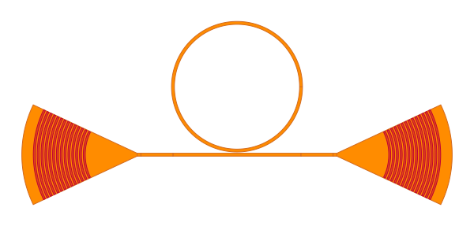

Creating Circuits
-----------------

``Circuit`` class in palgds is used for creating automated layouts of complex photonic circuits.
The designer provides the individidual components and the links between their ports. The the optical or 
electrical routes aoutomatically generated in ``Circuit`` class. 

Let's create a simple circuit with a ring resonator and grating couplers. For this we will use the same ring
resonator PCell definition that we used in previous section.

.. code-block:: python

    ring_res = RingResonator(name="RingRes", radius=10, gap=0.2, width=0.45)

We will read grating coupler from GDS file. Make sure you download and put "Grating_Coupler.gds" 
file into your working directory. Here, we are manually providing the port of the grating coupler.

.. code-block:: python

    gc = bc.GDSCell(name="Grating_Coupler", filename='Grating_Coupler.gds',
                    ports={"in": bc.Port((1, 0), 0, "op")})

Now, we will create the circuit using these components:

Let's create a Mach-Zehnder interferometer circuit. We will read a custom made Y-Branch with ``GDSCell``.
First, make sure you download and put "YBranch.gds" and "YBranch.txt" files into your working directory. Then
create the Y-Branch object:

.. code-block:: python

    ybranch = bc.GDSCell(name="YBranch", filename='YBranch.gds', ports_filename="YBranch.txt")

