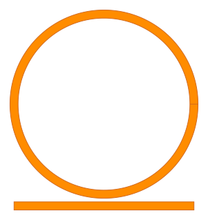

PCells
---------------

What is a PCell
***************

PCell stands for parameterized cell, a well-known concept in layout design for the dynamical creation of devices.
A PCell is a piece of code where the designer can create geometric primitives by adjusting the design parameters.
A PCell can also contain instances of other primitive PCells.

A PCell in ``palgds`` is a class that has two main attributes: ``cell`` and ``ports``.

*   ``cell`` is a ``gdstk.Cell`` object. A cell is a fundamental structure in the layout. It is composed of basic
    geometrical elements (Polygons and Paths) and references to other cells. For more information
    see `Cell`_ from **GDSTK** library.

*   ``ports`` is a python ``dict`` that stores the properties of the input/output connections of a PCell.
    Every **port** has a unique name, position, direction, and type information.

.. _Cell: https://heitzmann.github.io/gdstk/library/gdstk.Cell.html

Creating PCells
***************

In this section, to explain how a ``PCell`` works, we will create a parametric ``RingResonator`` class.
Start your code with following imports:

.. code-block:: python

    import gdstk
    import numpy as np
    import palgds.base_cells as bc

Every class that you create for building layout should inherit from ``PCell`` class. In the ``__init__()`` method
you can accept many parameters that you can adjust while creating a ring resonator. Using these parameters you can
create the geometric layout elements. In a basic ring resonator, these geometric elements will be a ring and a bus
waveguide. See the following code:

.. literalinclude:: _tutorial/example1.py
    :start-at: class RingResonator(bc.PCell)
    :end-at: return ports

Here, we created the ``cell`` in ``_create_cell`` method. The element, ring and bus waveguide, are created using
``gdstk.ellipse`` and ``gdstk.rectagle`` classes by providing appropriate parameters.

``ports`` is created in ``_create_ports`` method. The ports in a PCell is defined in the following way:

**Ports definition:** ``{name: (x, y, angle, type), ... }``

``name`` is the name of the port, ``x`` is the horizontal position (:math:`\mu m` by default), ``y`` is the
vertical position, ``angle`` is the orientation of port in radians, and ``type`` is the type of the port: either
``"op"`` for optical ports or ``"el"`` for electrical ports.

Therefore, ``ports`` attribute in a PCell is a dictionary of tuples tagged with port names. Currently, we will not use
the ports but they will be very important when creating circuits from PCells.

After creating ``RingResonator`` class we can create an instance of it. Thanks to the parametric implementation of this
class, we can easily create variants of ring resonators. Let's create a ``RingResonator`` object with 5 :math:`\mu m`
radius ring with a coupling gap of 0.2 :math:`\mu m` and a line-width of 0.45 :math:`\mu m`:

.. literalinclude:: _tutorial/example1.py
    :start-at: ring_res = RingResonator(name="RingRes", radius=10, gap=0.2, width=0.45)
    :end-at: ring_res.cell.write_svg(ring_res.name + ".svg")

However, we don't have to use the same
method to create ``cell`` object. Alternatively we could have done everything in the ``__init__()`` method.=====