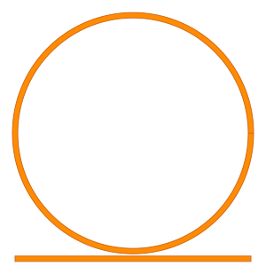

Creating PCells
---------------

Start your code with following imports:

.. code-block:: python

    import gdstk
    import numpy as np
    import palgds.base_cells as bc

Here you can create a custom PCell of a ring resonator:

.. code-block:: python
    :name: this-py

    class RingResonator(bc.PCell):
        def __init__(self, name, radius, gap, width, layer=3, datatype=0):
            cell = self._generate_cell(name, radius, gap, width, layer, datatype)
            ports = self._generate_ports(radius)
            super().__init__(cell, ports)

        def _generate_cell(self, name, radius, gap, width, layer, datatype):
            cell = gdstk.Cell(name)
            center = (0, radius+gap+width)
            ring = gdstk.ellipse(center, radius+width/2, radius-width/2, layer=layer, datatype=datatype, tolerance=2e-4)
            straight_waveguide = gdstk.rectangle((-radius, -width/2), (radius, width/2), layer=layer, datatype=datatype)
            cell.add(ring, straight_waveguide)
            return cell

        def _generate_ports(self, radius):
            ports = {"in": (-radius, 0, np.pi), "out": (radius, 0, 0)}
            return ports

Then, using that class definition we will create a RingResonator object with 10 um ra:

    rr = RingResonator(name="RingRes", radius=10, gap=0.2, width=0.45)

    lib = gdstk.Library()
    lib.add(rr.cell, *rr.cell.dependencies(True))
    lib.write_gds("ring_resonator.gds",max_points=4000)
    # In the following lines we will create connect two ring resonators in a circuit:

asdfsdf

See :ref:`this code snippet <this-py>` for an example.

